# CSS
---
###引入CSS的方法：
1.行间样式引入 标签内添加style
2.页面级 CSS head标签内添加 style标签，内书写CSS样式
3.外部CSS文件，使用link 来引入

浏览器一般是下载一行执行一行，当我们引入外部CSS文件的时候，下载顺序是，遇到CSS文件，久开启一个新的线程，异步下载（计算机的同步和异步是和现实中相反的）
异步 asynchronous;

### 选择器:


#### 标签选择器：
在 CSS 里边写上标签名{CSS 代码}，则 HTML 里边所有的此类标签都应用此 CSS 样式属性（不管这个标签在哪，也不管外边被套了多少层，都能被选中）。
```CSS
<div>
    <span>标签选择器</span>
</div>
<span>标签选择器</span>
div{
    width:100px;
    height:100px;
    background:red;
}
​
span{
    color：green;
    font-weight:blod;
}
```
#### id 选择器:
给 HTML 元素后边加上属性 id="id 值"，对应在 CSS 里边写上#id值{CSS 代码}，一个元素只能有一个 id 值，一个 id 值只能对应一个元素
```CSS
<div id="demo"></div>
#demo{
    width:100px;
    height:100px;
    background-color:red;
}
```

#### class 选择器（基础选择器）:

HTML 元素后边加上属性 class=“class 值”，对应在 CSS 里边写上 .class 值{CSS 代码}，和 id 不同的是：一个元素可以有多个 class 值（写法：class=“class 值 1 class 值 2”），一个class 值也可以对应多个元素。
```CSS
<div class="calss1 class2">this is a div</div>
.calss1{
    width:100px;
    height:100px;
    background-color:red;
}
​
.class2{
    color:green;
    font-size:30px;
    font-weight:blod;
}
```
#### 通配符选择器:
在 CSS 里边写上*{CSS 代码}，则 HTML 里边所有的标签都应用此CSS 样式属性。
```CSS
<ul>
    <li>苹果</li>
    <li>香蕉</li>
    <li>梨</li>
</ul>
​
<div>榆哥帅</div>
*{
    color:red;
    margin:0;
    padding:0;
}
```
所有标签的样式均会改变

#### 属性选择器:
在 CSS 里边写上[id]{CSS 代码} / [class]{CSS 代码}，则所有的id/class 元素都会应用此 CSS 样式，如果写上[id=“id 名”]{CSS 代码} / [class=“class 名”]{CSS 代码}，则只有被命名成这种 id/class 名的元素可以应用此样式。
```CSS
<div id="demo1">demo1</div>
<div id="demo2">demo2</div>
<div class="class1">class1</div>
<div class="class2">class2</div>
[id]{
    width: 100px;
    height: 100px;
    background-color: blue;
    color: red;
}

[id = "demo1"]{
    color:black;
}

[class]{
    width: 100px;
    height: 100px;
    background-color: rgb(77,77,77);
}
[class = 'class2']{
    width: 50px;
    height: 50px;
    background-color: yellow;
}
```
#### 选择器权重:
不同的选择器，优先级不同，对同一个标签使用不同的选择器，一般有不同的展示优先级，这是由于选择器的权重不同

CSS选择器权重
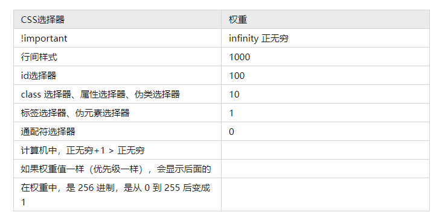

### CSS选择器（复杂选择器）:


#### 父子选择器，派生选择器:

父子选择器中，每一个层级，都不一样要是标签选择器，写 class 选择器也行，重要的是表达出来父子关系。而且这种父子关系有可能是间接地，也有可能是直接的

想要使得span1变成红色
```CSS
<div>
    <span>span1</span>
</div>
<span>span2</span>
div span{
    color:red;
}
```
父子选择器的权重，是所用选择器的权重相加。 直接子元素的话，也可以使用 ">" 来进行区分 例如：上述的话，还能使用 div > span

#### 并列选择器:


想让 2 变成 红色字体
```CSS
<div>1</div>
<div class="demo">2</div>
<p class="demo">3</p>
div.demo{
    color:red;
}
```

#### 分组选择器:


高内聚，弱耦合
可以简化代码,减少代码的耦合度

让 1，2，3均显示红色
```CSS
<em>1</em>
<strong>2</strong>
<span>3</span>
em,
strong,
span{
    color:red;
}
```

#### 伪类选择器:

```CSS
<a href="https://www.baidu.com"></a>
a {
    text-decoration: none;
}
a:hover {
    text-decoration: underline;
    color: #fff;
    background-color: #f40;
    font-size: 16px;
    font-weight: bold;
    font-family: Arial, Helvetica, sans-serif;
    border-radius: 10px;
}
```


#### 伪元素选择器:

```CSS
<p>hello world</p>
p:before{
    content: "我会出现在整个段落的最前边";
    color: red;
}
p:after{
    content: "我会出现在整个段落的最后边";
    color: yellow;
}
```

## 一些常见的修改样式:
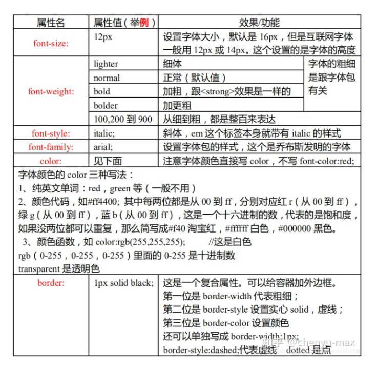
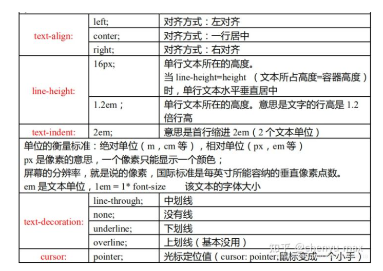

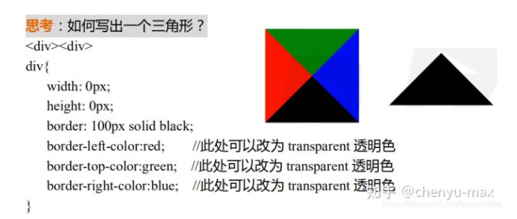

### 初始化标签
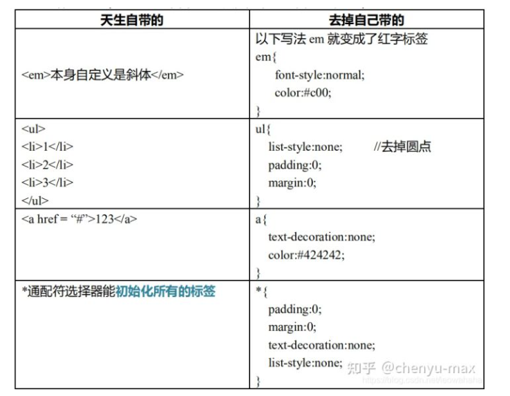

## 盒子模型(important)


盒子的组成三大部分：

1.盒子壁 border
2.盒子内边距 padding
3.盒子内容 width+height

盒子模型（四部分组成）

1.盒子壁 border
2.盒子内边距 padding
3.盒子内容 content=width+height
4.盒子外边距 margin

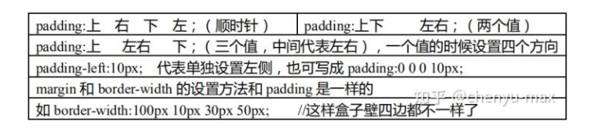

padding 内边距是不能放内容的。内容是放到内容区 content 的

1.此种情况两个div重叠
```CSS
<div class="wrapper">
    <div class="content"></div>
</div>
.wrapper {
    width: 100px;
    height: 100px;
    background-color: red;
}

.content {
    width: 100px;
    height: 100px;
    background-color: black;
}
```
```CSS
更改wrapper属性
.wrapper {
    border: 10px solid green;
    width: 100px;
    height: 100px;
    background-color: red;
}
```

#### 盒模型的计算(可视区的宽高，真实的大小)
```CSS
div {
    width: 100px;
    height: 100px;
    padding: 0 100px;
    margin: 10px 20px 30px 40px;
    border: 1px solid orange;
    background-color: orange;
}
```
realWidth：100+100+100+1+1px=302px

realHeight：100+0+0+1+1px=102px

#### 远视图:
```CSS
<div class="wrapper">
   <div class="box">
        <div class="content1">
            <div class="content2"></div>
        </div>
   </div>
</div>
.wrapper {
    width: 50px;
    height: 50px;
    background-color: #000;
    padding: 10px;
    }

    .box {
    width: 30px;
    height: 30px;
    background-color: #0f0;
    padding: 10px;
    }

    .content1 {
    width: 10px;
    height: 10px;
    background-color: #000;
    padding: 10px;
    }

    .content2 {
    width: 10px;
    height: 10px;
    background-color: #0f0;
}
```

### 定位 position

定位元素需要配合 right，left，top，bottom 使用（浏览器 y 轴是向下的），但是一般是不设置bottom 的，因为浏览器一般没有底部

#### position: absolute
绝对定位,脱离原来位置定位

层模型部分
初始状态
```CSS
<div class="demo"></div>
<div class="box"></div>
.demo {
    width: 100px;
    height: 100px;
    background-color: red;
    opacity: 0.5;
}

.box {
    width: 150px;
    height: 150px;
    background-color: green;
}
```
给demo添加了绝对定位
```CSS
.demo {
    position:absolute;
    width: 100px;
    height: 100px;
    background-color: red;
    opacity: 0.5;
}
```
给其添加 left 和 top 值
```CSS
.demo {
    position: absolute;
    width: 100px;
    height: 100px;
    background-color: red;
    opacity: 0.5;
    top: 100px;
    left: 100px;
}
```

#### position:relative
relative 是保留原来位置进行定位

给demo添加relative定位
```CSS
.demo {
    position: relative;
    background-color: red;
    opacity: 0.5;
    width: 100px;
    height: 100px;
}
```
给 demo 添加 left 和 top 值
```CSS
.demo {
    position: relative;
    background-color: red;
    opacity: 0.5;
    width: 100px;
    height: 100px;
    top: 100px;
    left: 100px;
}
```

### absolute + relative 定位例子
最初样式
```CSS
<div class="wrapper">
    <div class="content">
        <div class="box"></div>
    </div>
</div>
.wrapper {
    width: 200px;
    height: 200px;
    background-color: orange;
}

.content {
    width: 100px;
    height: 100px;
    background-color: black;
}

.box {
    width: 50px;
    height: 50px;
    background-color: yellow;
}
```
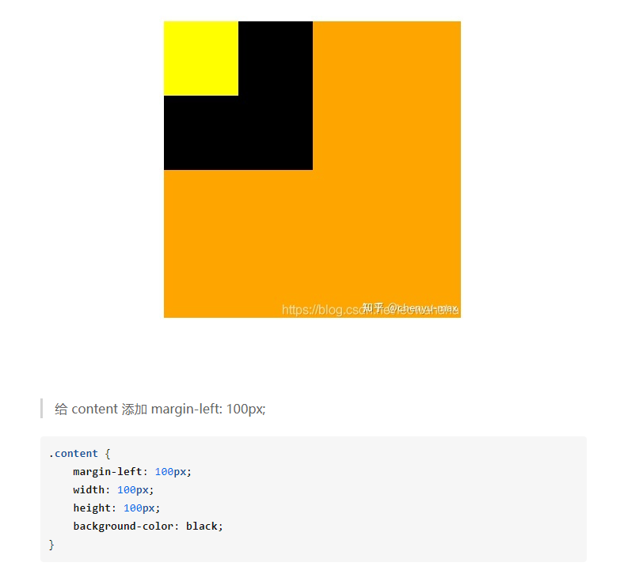
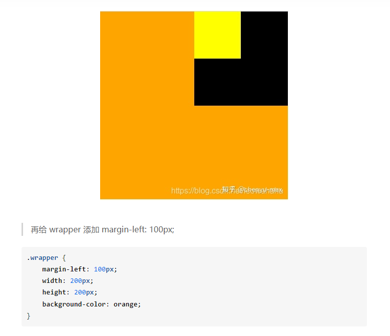
再给 wrapper 添加 margin-left: 100px;
```CSS
.wrapper {
    margin-left: 100px;
    width: 200px;
    height: 200px;
    background-color: orange;
}
```
给 box 添加 absolute 绝对定位
```CSS
.box {
    width: 50px;
    height: 50px;
    background-color: yellow;
    position: absolute;
    left: 50px;
}
```
相对于最近一个有定位的父级的进行定位

给 content 添加 relative 定位
```CSS
.content {
    margin-left: 100px;
    width: 100px;
    height: 100px;
    background-color: black;
    position: relative;
}
```
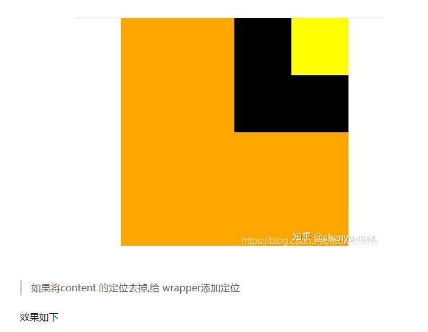
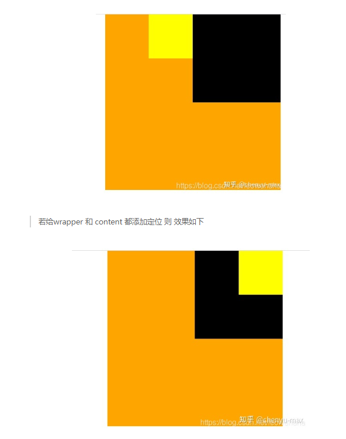
说明 absolute 定位是相对于最近的有定位的父级进行定位的
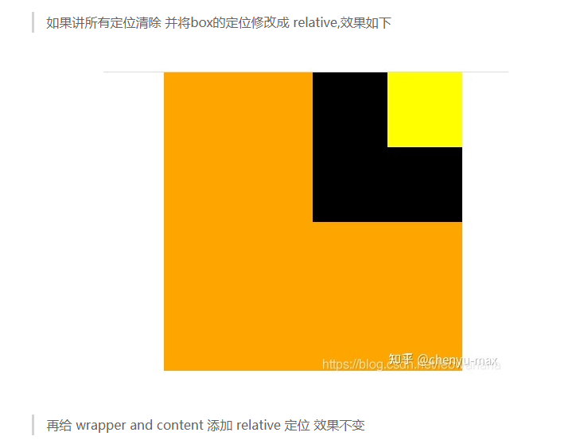

### absolute 和 relative 定位的区别比较

absolute 定位：脱离原来位置定位。是相对于最近的有定位的父级进行定位；如果没有有定位的父级元素，就相对于文档进行定位
relative 定位：保留原来的位置进行定位，相对于自己原来（出生的）的位置进行定位


经验:什么时候用 relative，什么时候用 absolute?

如果想定位，最好找参照物。

我们一般用 relative 作为参照物（不用 relative 进行定位），用 absolute 进行定位
给一个元素只设置一个 relative，不设置 left,right，top，bottom，看起来是对这个元素没什么影响的，但是它保留了原来的位置，就对后续元素没有什么影响

absolute 可以任意的调整自己的参照物，更加灵活，所以用于定位想让谁成为基地，就给谁 relative 定位，并且不设置方向

#### position:fixed
固定定位

可以用作小广告，不管滚动条怎么动，它都在一个固定的位置上面
```CSS
div {
    width: 100px;
    height: 100px;
    background-color: yellow;
    position: fixed;
    right: 50px;
    top: 400px;
}
```
### 思考,如何让一个块元素于浏览器中居中
如果用 left: 50%; 进行居中. 实际上是元素的左顶点居中,而非完全居中
所以居中应该是如下
```CSS
div {
    width: 100px;
    height: 100px;
    background-color: yellow;
    position: absolute;
    left: 50%;
    margin-left: -50px;
}
```
让margin-left 为 - width/2 (负一半宽度)

transform: translateX(-50%)可以在不知道宽的情况下，达到水平居中

### 思考 如何形成五环
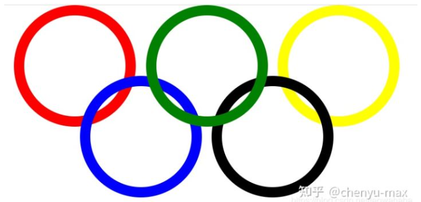
```CSS
<div class="wrapper">
    <div class="circle1"></div>
    <div class="circle2"></div>
    <div class="circle3"></div>
    <div class="circle4"></div>
    <div class="circle5"></div>
</div>
* {
    padding: 0;
    margin: 0;
}

.wrapper {
    position: absolute;
    left: 50%;
    height: 186px;
    width: 380px;
    margin-left: -190px;
}

.circle1,
.circle2,
.circle3,
.circle4,
.circle5 {
    position: absolute;
    width: 100px;
    height: 100px;
    border: 10px solid black;
    border-radius: 50%;
}

.circle1 {
    border-color: red;
    left: 0;
    top: 0;
}

.circle2 {
    border-color: green;
    left: 130px;
    top: 0;
    z-index: 3;
}

.circle3 {
    border-color: yellow;
    left: 260px;
    top: 0;
}

.circle4 {
    border-color: blue;
    left: 65px;
    top: 70px;
}

.circle5 {
    border-color: black;
    left: 195px;
    top: 70px;
}
```
### 两栏布局
```CSS
<div class="right"></div>
<div class="left"></div>
* {
    margin: 0;
    padding: 0;
}

.right {
    position: absolute;
    right: 0;
    background-color: pink;
    width: 100px;
    height: 100px;
    opacity: 0.5;
}

.left {
    margin-right: 100px;
    background-color: #000;
    height: 100px;
}
```
黑的是自适应元素，随着浏览器自适应，这是块级元素的特点

### 两个经典bug
叫bug就是说明还没有解决的问题,但是我们可以用技术来将它弥补

#### margin塌陷
```CSS
.wrapper {
    width: 100px;
    height: 100px;
    background-color: black;
    margin-top: 100px;
    margin-left: 100px;
}

.content {
    margin-left: 50px;
    margin-top: 100px;
    width: 50px;
    height: 50px;
    background-color: green;
}
```
设置 margin-top:100px;时失效了绿色的方块并没有跟着动,而当 margin-top:150px;时（大于父级高），那么绿色的就会带着父级黑色的一起动

父子嵌套元素垂直方向的 margin，父子元素是结合在一起的，他们两个会取其中最大的值正常情况应该是父级相对于浏览器进行定位，子级应该相对于父级定位的但是 margin 塌陷是在父级相对于浏览器进行定位时，子级没有相对于父级定位，就像父级的棚子没有了一样子级相对于父级，就像塌陷了一样
margin 塌陷解决方案：不能用加border的土法子

应该用 bfc，改变父级的渲染规则 block format context 块级格式化上下文

弥补 margin 塌陷，可以使用 bfc，如何触发一个盒子的 bfc？

1.position:absolute;
2.display:inline-block;
3.float:left/right; //浮动
4.overflow:hidden; //溢出盒子的部分要隐藏展示

### margin合并
```CSS
<span class="box1">12</span>
<span class="box2">34</span>

<div class="demo1">1</div>
<div class="demo2">2</div>
* {
    margin: 0;
    padding: 0;
}

.box1 {
    background-color: red;
    margin-right: 100px;
}

.box2 {
    background-color: green;
    margin-left: 100px;
}

.demo1 {
    background-color: green;
    margin-bottom: 100px;
}

.demo2 {
    background-color: red;
    margin-top: 100px;
}
```
box1 和 box2 之间的左右距离 是200px ,demo1 和 demo2之间的距离 还是只有200px

解决办法:margin 合并依然使用 bfc 解决

给box2添加一个父级div wrapper 为其添加 overflow: hidden;
给两个div都添加一个父级bfc
tips:上面这两种解决 margin 合并的方法，但改变了 HTML 的结构，这在开发中是不允许的
实际开发中，在 margin 合并这个 bug 上，我们不用 bfc（不能改变 html 的结构）假如我们需要两个 div 直接有 300px，那就设置上面的 margin-bottom:300px;来解决距离的问题

</br>

三大模型是盒模型，层模型，浮动模型 </br>

### 浮动模型
float:left/right
```CSS
<div class="wrapper">
    <div>1</div>
    <div>2</div>
    <div>3</div>
    <div>4</div>
    <div>5</div>
</div>
* {
  margin: 0;
  padding: 0;
}

.wrapper {
    width: 300px;
    height: 300px;
    border: 1px solid black;
}

.wrapper div {
    width: 100px;
    height: 100px;
    background-color: blue;
    float: left;
}
```
直接看效果

浮动元素上可以加 margin-left 或 margin-top，这下面几个图片就是用浮动做的。 float 站队时，够站一个就站一个，不够站一个就换行float 站队的边界就是父级元素的边界
float 元素是分层了。跟 absolute 效果是类似的

浮动元素产生了浮动流（浮动流产生的效果）所有产生了浮动流的元素，块级元素看不到他们。产生了 bfc 的元素和文本类属性（带有 inline 属性就是文本类属性）的元素以及文本都能看到浮动元素

#### clear清除浮动
而为了清除 float 的浮动流，就可以用到伪元素，也是最好的选择clear 很特殊，想让他生效，必须是块级元素才可以，而::after 是行级元素

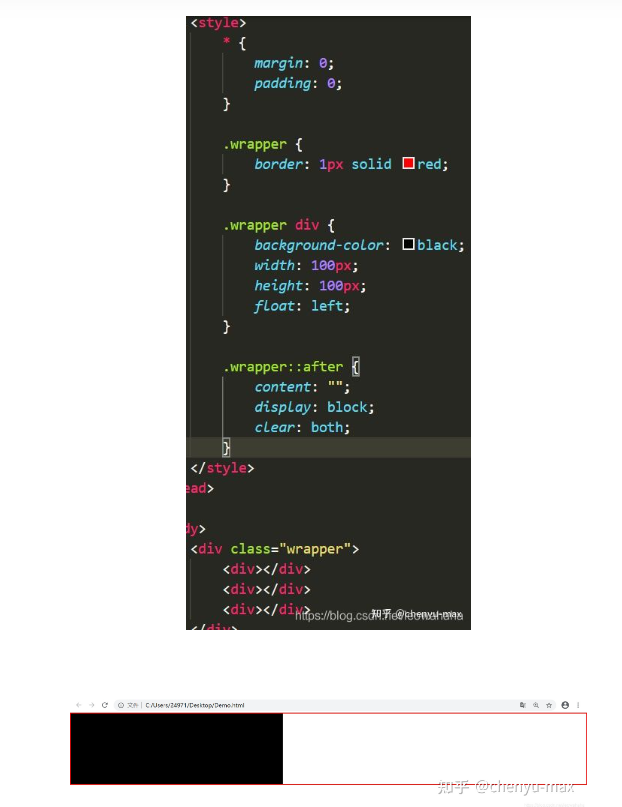

###拓展
想让单行文本溢出文字，打点，步骤

首先先让文本失去换行功能，white-space:nowrap;

再溢出部分不展示隐藏，overflow:hidden;

最后把溢出部分打点，text-overflow:ellipsis;