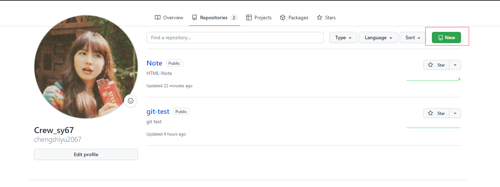
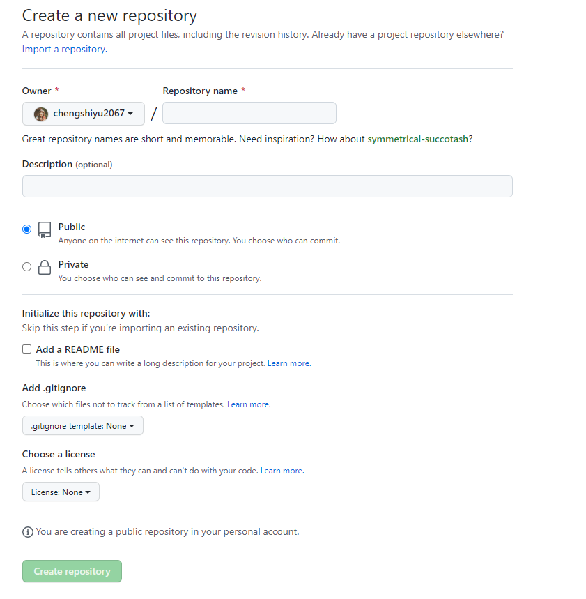
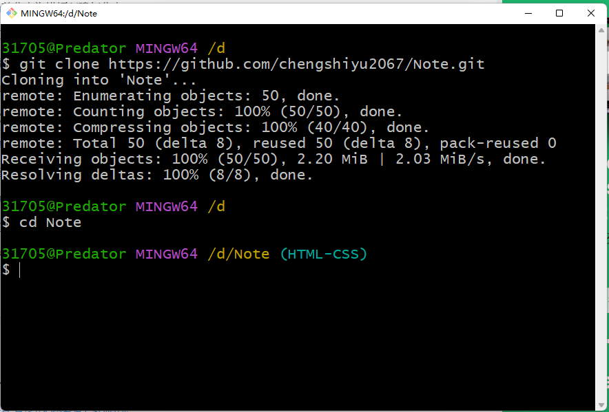
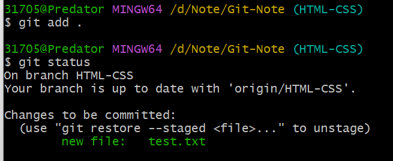
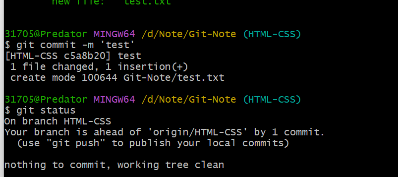
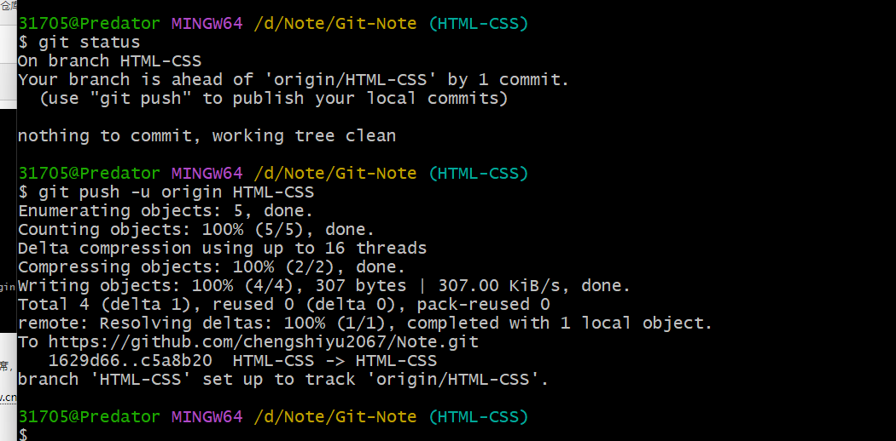

# Git及Github
---

### github创建仓库

### 本地clone 远程仓库

### git创建远程分支
1、git branch -rv 查看所有远程分支
2、git checkout -b + 分支名   创建分支
3、git push --set-upstream origin + 刚刚创建的分支名  远程分支创建成功

### 用git clone远程的所有分支
git clone只能clone远程库的master分支，无法clone所有分支，解决办法如下：
1. 找一个干净目录，假设是git_work
2. cd git_work
3. git clone http://myrepo.xxx.com/project/.git ,这样在git_work目录下得到一个project子目录
4. cd project
5. git branch -a，列出所有分支名称如下：
remotes/origin/dev
remotes/origin/release
6. git checkout -b dev origin/dev，作用是checkout远程的dev分支，在本地起名为dev分支，并切换到本地的dev分支
7. git checkout -b release origin/release，作用参见上一步解释
8. git checkout dev，切换回dev分支，并开始开发。
   
### 上传文件到github远程仓库

add到暂存区

commit到本地仓库

上传到远程仓库

### linux/git 复制/剪切文件到另一个文件夹
复制/拷贝：

cp  文件名  路径      cp  hello.csv  ./python/ml：把当前目录的hello.csv拷贝到当前目的python文件夹里的ml文件夹里

cp 源文件名  新文件名   cp  hello.txt   world.txt：复制并改名,并存放在当前目录下  

cp file1 file2 复制一个文件 
cp dir/* . 复制一个目录下的所有文件到当前工作目录 
cp -a /tmp/dir1 . 复制一个目录到当前工作目录 
cp -a dir1 dir2 复制一个目录 

剪切/移动：

mv 文件名 路径

mv hello.csv ./python：把当前目录的hello.csv剪切到当前目的python文件夹里

mv  hello.txt  ../java/   把当前目录下的文件hello.txt剪切到上一级目录的子目录java目录里

mv  hello.txt  ..     把文件hello.txt移动到上一级目录