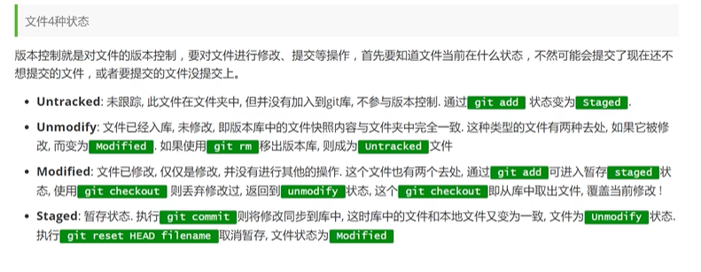
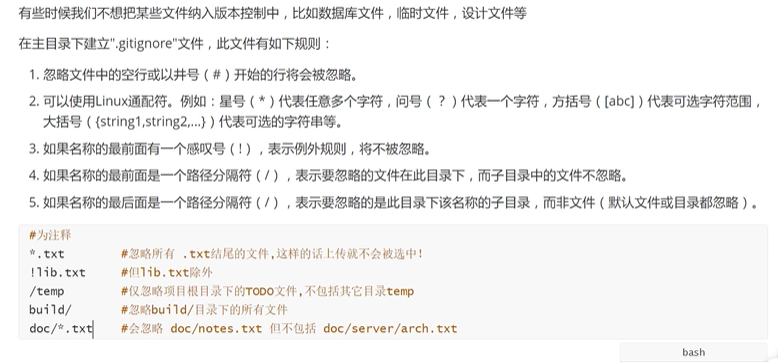
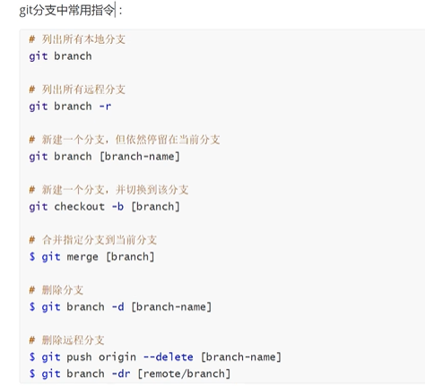

#linux常用命令、
---
1.cd：改变目录
2.cd.. 回退到上个目录，直接cd进入默认目录
3.pwd：显示当前所在的目录路径
4.ls（ll）：都是列出当前目录中的所有文件，只不过ll列出的内容更为详细
5.touch：新建一个文件，如touch index.js 就会在当前目录下新建一个index.js文件
6.rm：删除一个文件，rm index.js 就会把index.js文件删除
7.mkdir：新建一个目录，就是新建一个文件夹
8.rm -r：删除一个文件夹，rm -r src 删除src目录
9.mv移动文件，mv index.html src index.html是我们要移动的文件，src是目标文件夹，当然这样写

10.reset重新初始化终端/清屏
11.clear清屏
12.history查看命令历史
13.help帮助
14.exit推出
15.#表示注释

#git常用配置
---
git config -l 查看配置
git config --system --list 查看系统配置列表
git config --global --list 查看全局列表

所有的配置文件都保存在本地 

git config --global user.name 'csy'  //创建用户名
git config --global user.email '317054864@qq.com'  //邮箱

#git工作原理
---
workspace：工作区，就是你平时存放项目代码的地方
index/stage：暂存区，用于临时存放你的改动，事实上他就只是一个文件，保存即将提交到文件列表信息
repository：仓库区，就是安全存放数据的位置，这里面有你提交到所有版本的数据，其中head指向最新放入仓库的版本
remote：远程仓库，托管代码的服务器，可以简单的认为是你项目组中的一台电脑用于远程交换

#git代码
---
###创建本地仓库的方法有两种：一种是创建全新的仓库，另一种是克隆远程仓库
git init 在当前目录新建一个git代码库
执行后可以看到，仅仅在项目目录多出了一个.git目录，关于版本等的所有信息都在这个目录里

git clone [url]  克隆一个远程仓库

###git的基本操作命令

git status[filename] 查看指定文件状态

git status 查看所有文件状态

git add .  添加所有文件到缓存区

git commit -m 提交暂存区中的内容到本地仓库 -m 提交信息

###忽略文件

###git中常用的分支命令
