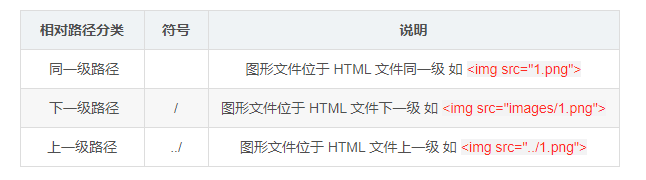

#HTML
---
###基本标签结构：


###文档声明类型标签：
```html
<!DOCTYPE html> 
```
文档声明类型，作用就是告诉浏览器使用那种HTML版本来显示网页
```HTML
<!DOCTYPE html>
```
这句代码的意思是：当前页面采取的是 HTML5 版本来显示网页
**注意：**
!DOCTYPE 声明位于文档中的最前面的位置，处于 <html> 标签之前
!DOCTYPE不是一个 HTML 标签，它就是文档类型声明标签

###lang语言种类：
用来定义当前文档显示的语言

en 定义语言为英语
zh-CN 定义语言为中文
```html
<html lang="en">
```

### 字符集:
在 head标签内，可以通过 meta 标签的 charset 属性来规定 HTML 文档应该使用那种字符编码
```html
<meta charset="UTF-8">
```

### 标签:

####标题标签：
```html
<body>
    <h1> 一级标题</h1>
    <h2> 二级标题</h2>
    <h3> 三级标题</h3>
    <h4> 四级标题</h4>
    <h5> 五级标题</h5>
    <h6> 六级标题</h6>
</body>
```

####段落标签:
```html
<p>段落标签</p>
```
paragraph 的缩写
文本在一个段落这种会根据浏览器窗口的大小进行自动换行
段落和段落之间保有空隙

####换行标签:
```HTML
<br />
<br /> 是个单标签
<br /> 标签只是简单的开始新的一行，跟段落不一样，段落之间会插入一些垂直的间距
```

####文本格式化标签:
为文字设置粗体、斜体、下划线等效果

重点记忆 **加粗** 和 **倾斜**

####盒子标签:
```html
<div></div>: 一行只能放一个大盒子
<span></span>: 一行可以放多个小盒子
<div>这是头部</div>
<span>今日价格</span>
```

####图像标签:
```html

src 是  标签的必须属性，它用于指定图像文件的路径和文件\
```


###路径:

####相对路径:


####绝对路径:
绝对路径：是指目录下的绝对位置，直接达到目标位置，通常是从盘符开始的路径

###超链接标签:
```html
<a href="跳转目标" target="目标窗口的弹出方式">文本或图像</a>
```

如果 href 里面地址是一个文件夹或者压缩包，会下载这个文件
```html
<a href="img.zip"></a>
```
###锚点链接:
作用：点击链接，可以快速定位到页面中的某个位置

在链接文本的 href 属性中，设置属性值为 #名字
找到目标位置标签，里面添加一个 id属性=刚才的名字
```HTML
<a href = "#two">黄伟</a>
<h3 id = "two">黄伟牛</h3>
```

###特殊字符:

重点记住：**空格、大于号、小于号** 这三个，其余的使用的很少，如果需要使用回头查阅即可


###表格标签：
table 用来定义表格的标签
tr 用来定义表格中的行，必须嵌套在 table 标签中
td 用来定义表格中的单元格，必须嵌套在 tr 标签中
th 用来定义表格中的表头，表头单元格里面的内容加粗居中显示
```html
<body>
     <table>
          <tr> <th>姓名</th>   <th>性别</th>   <th>年龄</th>    </tr>
          <tr> <td>黄伟</td>   <td>男</td>   <td>25</td>    </tr>
          <tr> <td>黄伟</td>   <td>男</td>   <td>25</td>    </tr>
          <tr> <td>黄伟</td>   <td>男</td>   <td>25</td>    </tr>
     </table>
</body>
```

####表格结构标签:
为了更好的表示表格的语义，可以将表格分割成 表格头部 和表格主体两个部分
```html
用 <thead></thead> 标签表示表格的头部区域， <thead> 内部必须拥有 <tr> 标签，一般是位于第一行
用 <tbody></tbody> 标签表示表格的主体区域，主要是用于放数据本体
以上标签都是放在 <table></table> 标签中
```


####合并单元格
跨行合并：rowspan="合并单元格的个数"
跨列合并：colspan="合并单元格的个数"
```html
<tb colspan = "2"></td>
```

###列表标签:

```html
<dl>
    <dt>关注我们</dt>
    <dd>新浪微博</dd>
    <dd>联系我们</dd>
</dl>
```

###表单标签
一个完整的表单通常由表单域，表单控件（表单元素）和提示信息3部分组成


####表单域
表单域是一个包含表单元素的区域
```HTML
<form></form> 标签用于定义表单域，会把它范围内的表单元素信息提交给服务器
```

```html
<form action="url地址" method="提交方式" name="表单域的名称">
 
</form>
```

####表单控件(表单元素)
①input输入表单元素

input 输入表单元素
input 是个单标签， type 属性设置不同的属性用来指定不同的控件类型（文本字段、复选框、单选框、按钮等）
type 属性的属性值及描述如下：

**name** 和 **value** 是每个表单元素都有的属性值，主要给后端人员使用
name 是表单元素的名字，要求 **单选框和复选框要有相同的name值**
**checked 属性主要针对于单选框和复选框**，主要作用是打开页面，就可以默认选中某个表单元素

②文本框与密码框

type 属性设置为 text 是文本框
type 属性设置为 password 是密码框
```html
<body>
   <form>
       用户名: <input type="text"> <br />
       密码: <input type="password">
   </fotm>
</body>
```

③单选框和复选框

type 属性设置为 radio 是单选框
type 属性设置为 checkbox 是复选框
name 是表单元素的名字，要求 单选框和复选框要有相同的name值
```HTML
<form>
  用户名:<input type="text"><br /> 
  密码:<input type="password"> <br />
  <!-- radio是单选框，可以多选一 -->
  性别: 男<input type="radio"> 女 <input type="radio">
  <!-- checkbox是多选框，可以多选 -->
  爱好: 吃饭<input type="checkbox"> 睡觉<input type="checkbox"> 打游戏<inputtype="checkbox">
</form>
```

④name和value属性

name属性：当前input表单的名字，后台可以通过这个name属性找到这个表单，name的主要作用就是用于区别不同的表单
```html
<form>
        用户名:<input type="text" value="请输入用户名"><br /> 密码:<input type="password"> <br />
        <!-- radio是单选框，可以多选一 -->
        <!-- name是表单元素的名字，这里的性别单选按钮必须有相同的名字name，才能实现多选一 -->
        性别: 男<input type="radio" name="sex" value="男"> 女 <input type="radio" name="sex" value="女">
        <!-- checkbox是多选框，可以多选 -->
        爱好: 吃饭<input type="checkbox" name="habby" value="吃饭"> 睡觉<input type="checkbox" name="habby" value="睡觉"> 打游戏<input type="checkbox" name="habby" value="打游戏">
</form>
```

⑤checked和maxlength

单选按钮和复选框可以设置cheked 属性
当页面打开的时候就可以默认选中这个按钮
单选框只能给其中一个加checked，复选框可以多加
```HTML
性别: 男<input type="radio" name="sex" value="男" checked="checked"> 女 <input type="radio" name="sex" value="女">
maxlength：规定最多输入多少个字符
```
⑥submit和reset

type 属性设置为submit：提交按钮会把表单数据发送到服务器
type 属性设置为 reset：重置按钮会清楚表单中的所有数据
⑦button和文件域

type 属性设置为button：是一个按钮
type 属性设置为file：是一个文件域，可以上传文件
```html
 <input type="button" value="获取短信验证码"> <br />
        <!-- 文件域: 上传文件使用的 -->
        上传头像： <input type="file">
```
⑧label

label 标签用于绑定一个表单元素，当点击 lable 标签内的文本时，浏览器就会自动将焦点(光标)转到表单元素上，用来增加用户体验
label 标签的 for属性 应当与相关的 id 属性相同
```html
<lable for="sex"> 男 </lable>
<input type="radio" name="sex" id="sex"
```

###select下拉表单元素
下拉表单元素
```html
<select> 中至少包含一对 <option>
在 <option> 中定义 selected="selected" 时，当前项即为默认选中项
<select>
        <option selected="selected">选项1</option>
        <option>选项2</option>
        <option>选项3</option>
        ...
</select>
```
###textarea 文本域元素
用于定义多行文本输入的控件
```HTML
 <textarea>
      文本内容
</textarea>
```
**cols** = "每行中的字符数"，**rows** = "显示的函数"，我们在实际开发中不会使用，都是用CSS来改变大小

###表单元素总结:
表单元素我们学了三大组

input 输入表单元素
select 下拉表单元素
textarea 文本域表单元素
这三组表单元素都应该包含在 form 表单域里面，并且有 name 属性